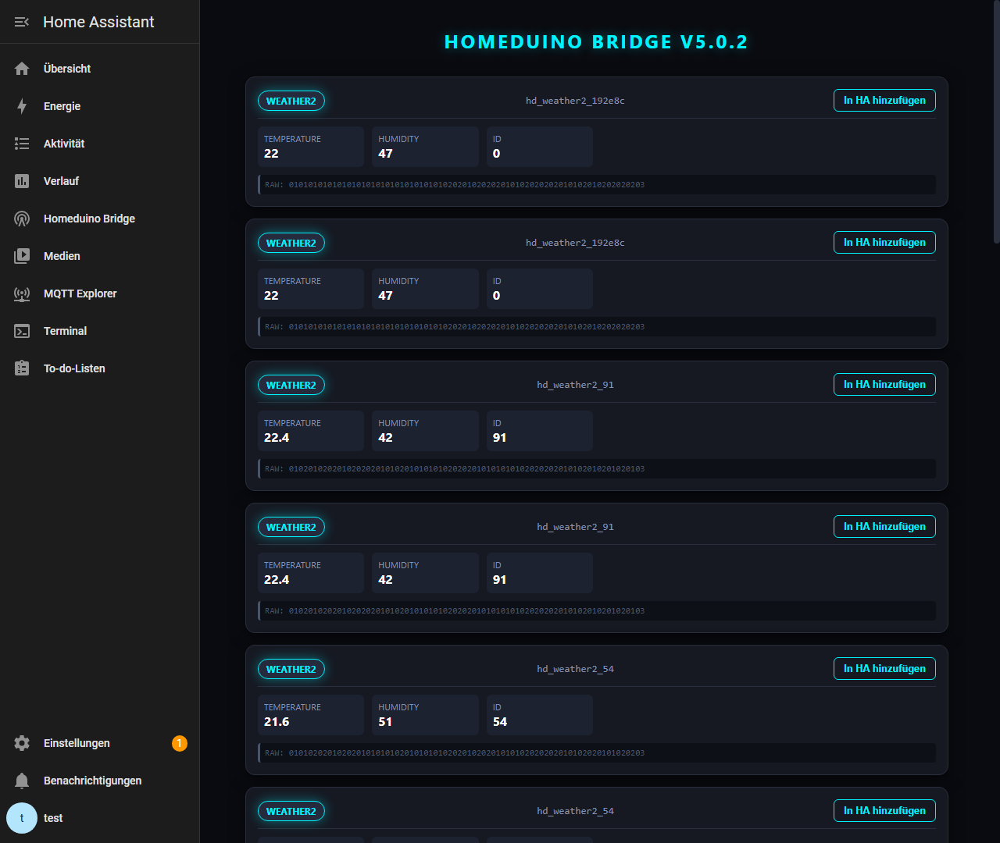
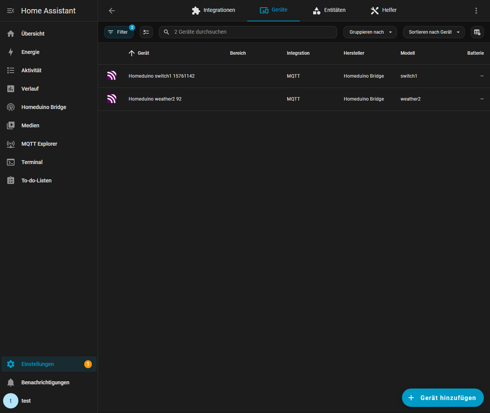

# Homeduino Bridge v5.0.2

Modernized Home Assistant Add-on that bridges 433MHz devices to Home Assistant using an Arduino (Homeduino) and MQTT.

## 🚀 Features

- **Fancy Dark UI**: A high-tech "Cyberpunk" style real-time scanner.
- **Selective Discovery**: Easily add discovered sensors and switches to Home Assistant with a single click.
- **Humidity Support**: Fixed extraction for weather protocols (e.g., weather2).
- **Robust Serial Handling**: Automatic re-triggering of the receiver and fragmented line protection.
- **MQTT Discovery**: Automatically creates devices in HA with correct classes (temperature, humidity, switch).
- **Ingress Support**: Access the UI directly from the Home Assistant sidebar.

## 🛠 Hardware Setup

To use this add-on, you need a **Homeduino** compatible hardware setup:

1. **Arduino Nano/Uno**: Connected via USB to your Home Assistant host.
2. **433MHz Receiver**: (e.g., RXB6 or similar high-quality module) connected to the Arduino.
3. **433MHz Transmitter**: (Optional, for switches) connected to the Arduino.
4. **Homeduino Sketch**: The Arduino must be running the [Homeduino Sketch](https://github.com/pimatic/homeduino).

### Typical Connection:
- Receiver Data -> Arduino Pin D2 (Interrupt)
- Transmitter Data -> Arduino Pin D4

## 🖥 User Interface

The modern Web UI allows you to monitor incoming signals and add them to your smart home.



### Selective Discovery
When a signal is detected, simply click the **"In HA hinzufügen"** button. The add-on will immediately send a discovery message to Home Assistant, and the device will appear in your MQTT integration.



## 📦 Installation

1. Add this repository to your Home Assistant Add-on Store.
2. Install **"Homeduino Bridge"**.
3. Configure your `serial_port` (e.g., `/dev/ttyUSB0`) and MQTT settings.
4. Start the add-on.

## ⚙️ Configuration

Example `options.json`:
```json
{
  "serial_port": "/dev/ttyUSB0",
  "baud_rate": 115200,
  "mqtt_broker": "core-mosquitto",
  "mqtt_port": 1883,
  "debug": true
}
```

## 📝 Troubleshooting

- **No signals?** Check your `serial_port` and ensure the Arduino is flashed correctly.
- **MQTT issues?** Ensure the Mosquitto broker add-on is running and credentials are correct.
- **Debug logs**: Set `debug: true` in the configuration to see raw bitstreams in the add-on log.

---
*Maintained by gier76*
